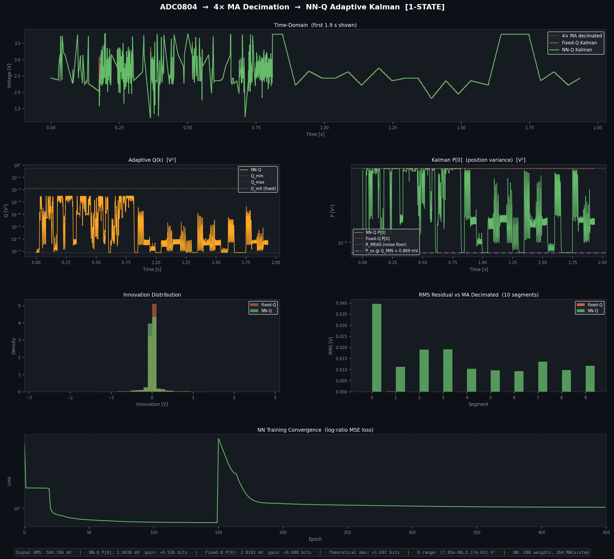
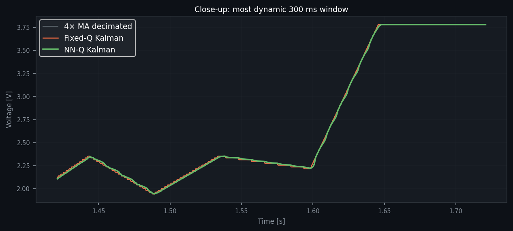

# NN-Q Adaptive Kalman Filter for Low-Resolution ADCs

**Adaptive noise reduction for 8-bit ADC signals using a neural network–controlled Kalman filter.**
Pure NumPy · 288 weights · 264 MACs/sample · No external ML frameworks

---

## Overview

Low-resolution ADCs suffer from quantization noise.
For an 8-bit ADC (5V reference):

```
Noise ≈ LSB / √12 ≈ 5.64 mV
```

This project improves effective resolution using:

* **Oversampling (4× moving average)**
* **Adaptive Kalman filtering with learned process noise (Q)**

---

## Pipeline

```
Raw ADC (10 kSPS)
      │
      ▼  4× Moving Average
      →  noise: 5.64 → 2.82 mV  (+1 bit)
      │
      ▼  NN-Q Adaptive Kalman (1-state)
      →  noise: ~2.82 → ~1.93 mV  (~+0.5 bit typical)
      │
      ▼  Output
```

**Measured improvement:** ~+1.5 bits ENOB
**Theoretical limit:** ~+2.7 bits (signal-dependent)

---

## Key Idea

A standard Kalman filter uses a fixed process noise (Q).

This project instead:

* learns Q dynamically using a small neural network
* uses recent innovations (last 8 samples)
* adapts filtering strength in real time

Result:

* Strong noise reduction in steady regions
* Fast response during signal changes

---

## Results

### Full System Behavior



Shows adaptive Q, variance reduction, and overall system dynamics.

---

### Close-up (Noise Reduction)



Subtle noise reduction (~0.5 bit) without signal distortion.
Improvement matches theoretical expectations for a 1-state Kalman filter.

---

## Performance (Real ADC Data)

| Stage       | Noise (RMS) | Gain           |
| ----------- | ----------- | -------------- |
| Raw ADC     | 5.64 mV     | —              |
| 4× MA       | 2.82 mV     | +1.00 bit      |
| NN-Q Kalman | ~1.93 mV    | +0.5 bit       |
| **Total**   | —           | **~+1.5 bits** |

* Correlation: >0.999 (no distortion)
* Adaptive Q spans multiple orders of magnitude

---

## Neural Network

```
Input: 8-sample innovation history
 → Dense (16, tanh)
 → Dense (8, tanh)
 → Output (Q)
```

* Parameters: 288
* Compute: 264 MACs/sample
* Framework: NumPy only

---

## Installation

```bash
git clone https://github.com/vedantvikrampathak8-cloud/nn-q-kalman.git
cd nn-q-kalman
pip install numpy scipy matplotlib
```

---

## Usage

```bash
python nn_kalman_1state.py data/sample_adc.csv
```

Also supports:

* `.txt` (raw ADC values)
* `.mat` (ECG data)
* synthetic demo (no input)

---

## Data

A small real ADC sample is included:

```
data/sample_adc.csv
```

Used for:

* quick testing
* reproducibility

---

## Limitations

* Moving average reduces high-frequency content
* Kalman introduces small phase lag
* Performance depends on signal dynamics
* Training data influences generalization

---

## License

Apache 2.0
